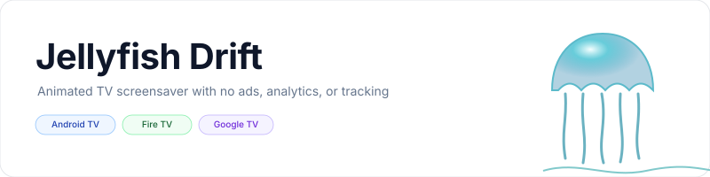
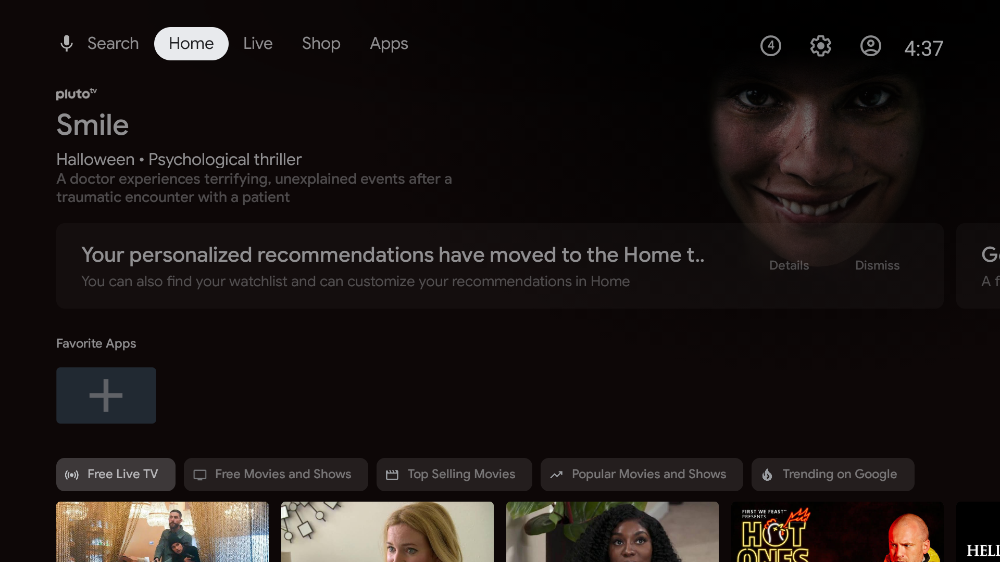
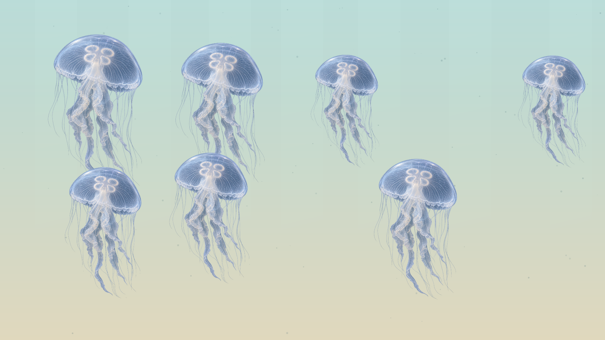

<p align="center">
    <picture>
        <source media="(prefers-color-scheme: dark)" srcset="art/banner-dark.svg">
        <source media="(prefers-color-scheme: light)" srcset="art/banner-light.svg">
        
    </picture>
</p>

<p align="center">A continuously animated jellyfish screensaver for Fire TV, Android TV, and Google TV.</p>

<p align="center">
    <a href="https://github.com/jeremykenedy/jellyfish-drift/releases"></a>
    <a href="https://github.com/jeremykenedy/jellyfish-drift/releases"></a>
    <a href="https://github.com/jeremykenedy/jellyfish-drift/actions/workflows/ci.yml"></a>
    <a href="https://github.com/jeremykenedy/jellyfish-drift/actions/workflows/style.yml"></a>
    <a href="https://github.com/jeremykenedy/jellyfish-drift/actions/workflows/docs.yml"></a>
    <a href="https://github.com/jeremykenedy/jellyfish-drift/actions/workflows/security.yml"></a>
    <a href="LICENSE"></a>
    <a href="https://github.com/jeremykenedy"></a>
    <a href="https://github.com/jeremykenedy/jellyfish-drift" title="Open the repository and click Star"></a>
    <a href="https://github.com/jeremykenedy/jellyfish-drift/stargazers"></a>
    <a href="https://github.com/sponsors/jeremykenedy"></a>
</p>

<p align="center">Show some love by starring this repository on GitHub.</p>

## Table of contents

- [Privacy](#privacy)
- [Features](#features)
- [Requirements](#requirements)
- [Installation](#installation)
- [Configuration](#configuration)
- [Screenshots](#screenshots)
- [Building and testing](#building-and-testing)
- [Documentation](#documentation)
- [License](#license)

## Privacy

The application requests no network permission and includes no advertising, analytics, telemetry, crash reporting, or tracking code. It does not make network requests.

## Features

- Animated jellyfish with translucent bells, pulsing motion, trailing tentacles, and drifting particles.
- Deep-water and bright open-water backgrounds.
- Jellyfish species, density, movement speed, and top-down light shimmer controls.
- Per-setting random selection and an option to randomize all settings each time the screensaver starts.
- D-pad-friendly settings that can be discovered by screensaver host applications.
- Android DreamService integration for compatible TV devices.

## Requirements

- Android 6.0 (API 23) or later.
- A device that exposes Android's DreamService screensaver settings.
- Android SDK platform 36 and build-tools 36.0.0 to build from source.

Fire TV, Android TV, and Google TV behavior is listed in [device verification](docs/VERIFICATION.md) only after it has been tested on each target.

## Installation

Download the signed APK and matching SHA-256 file from [GitHub Releases](https://github.com/jeremykenedy/jellyfish-drift/releases). Verify the checksum, install the APK, then select Jellyfish Drift in the device's Display or Ambient mode screensaver settings. The standalone installer and uninstaller are documented in [installation](docs/INSTALLATION.md).

## Configuration

Open Jellyfish Drift from the TV launcher to adjust its settings. The app stores preferences locally. See [configuration](docs/CONFIGURATION.md) for every option and its available values.

## Screenshots

<p align="center">
    
    
</p>

The dark preview was captured from the running app on an Android TV emulator. The light preview and [settings screen](docs/screenshots/settings-fire-tv.png) were captured on a Fire TV. The Fire TV DreamService capture is included in [device verification](docs/VERIFICATION.md).

## Building and testing

```bash
bash build.sh
bash test.sh
bash scripts/test-python-coverage.sh
bash scripts/test-coverage.sh
```

The build uses the Android SDK and JDK without third-party runtime dependencies. See [building](docs/BUILDING.md), [testing](docs/TESTING.md), and [architecture](docs/ARCHITECTURE.md).

## Documentation

- [Installation, update, and removal](docs/INSTALLATION.md)
- [Configuration](docs/CONFIGURATION.md)
- [Building from source](docs/BUILDING.md)
- [Architecture](docs/ARCHITECTURE.md)
- [Testing and coverage](docs/TESTING.md)
- [Device verification](docs/VERIFICATION.md)
- [CI](docs/CI.md)
- [Troubleshooting](docs/TROUBLESHOOTING.md)
- [Release process](docs/RELEASING.md)

Show some love by starring this repository on GitHub: [Star Jellyfish Drift](https://github.com/jeremykenedy/jellyfish-drift/stargazers).

## License

Jellyfish Drift is licensed under the [Apache License, Version 2.0](LICENSE). See [NOTICE](NOTICE) for project notices.
